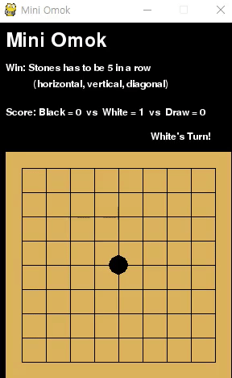
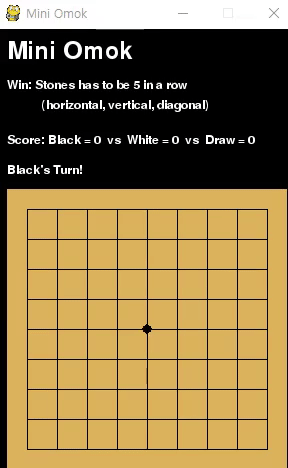
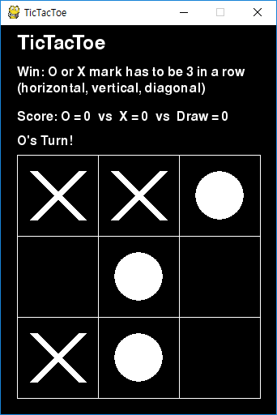
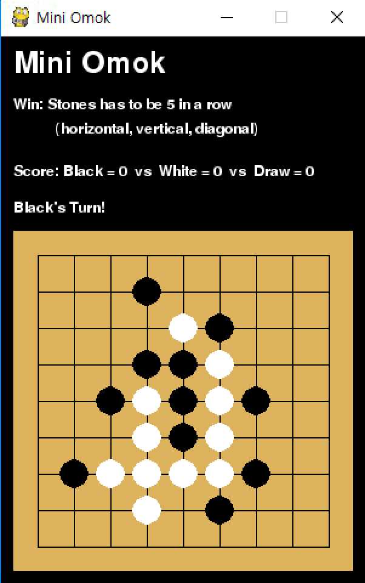

# Alpha-Omok

This is a project of [Reinforcement Learning KR group](https://www.facebook.com/groups/ReinforcementLearningKR/).

AlphaZero is a Reinforcement Learning algorithm which is effectively combine [MCTS(Monte-Carlo Tree Search)](https://en.wikipedia.org/wiki/Monte_Carlo_tree_search) with Actor-Critic. Alpha-Omok team wanted to apply [AlphaZero](https://deepmind.com/blog/alphago-zero-learning-scratch/) algorithm to famous board game [Omok (Gomoku)](https://en.wikipedia.org/wiki/Gomoku). Omok is a traditional game, which uses same gameboard with [Go](https://en.wikipedia.org/wiki/Go_(game)). Therefore we thought that it is proper game to apply AlphaZero algorithm.  For now, the algorithm is implemented by [Pytorch](https://pytorch.org/). [Tensorflow](https://www.tensorflow.org) version will be release soon!! 

## Training Result     

    
  
        
        
	

## Project objective

There are 4 objectives to achieve in this project  
1. MCTS on Tic-Tac-Toe
2. MCTS on Omok
3. AlphaZero on Omok
4. Upload AlphaZero on web

## Description of the Folders

### 1_tictactoe_MCTS

  

 This folder is for implementing MCTS in [Tic-Tac-Toe](https://en.wikipedia.org/wiki/Tic-tac-toe). If you want to study MCTS only, please check the files in this folder.  

The description of the files in the folder is as follows. (files with **bold text** are codes for implementation)

- env: Tic-Tac-Toe environment code (made with [pygame](https://www.pygame.org/news))
- **mcts_guide**: MCTS doesn't play the game, it only recommends how to play. 
- **mcts_vs**: User can play against MCTS algorithm. 
- utils: functions for implementing algorithm. 

### 2_AlphaOmok

  

  The folder is for implementing AlphaZero algorithm in omok environment. There are two versions of omok (env_small: 9x9, env_regular: 15x15). The above image is sample image of 9x9 omok game  

 The description of the files in the folder is as follows. (files with **bold text** are codes for implementation)

- **eval_local**: code for evaluating the algorithm on local PC
- **eval_server**: code for evaluating the algorithm on web
- **main**: main training code of Alpha Zero. 
- model: Network model (PyTorch)
- utils: functions for implementing algorithm. 

## Documents

- [ID-based implementation](https://github.com/reinforcement-learning-kr/alpha_omok/blob/Q_developer/docs/ID_based.md)
- [Description of the parameters]()
- [How to change the environment]()
- [How to load the saved model]()
- [How to use eval_local]()
- [How to use eval_web]()

## Future Work

- Apply parallel computation to improve computation speed
- Make [Tensorflow](https://www.tensorflow.org) version of the code
- Train the agent to solve 15x15 size Omok game
- Apply [Renju Rule](https://en.wikipedia.org/wiki/Renju)

## Reference

1. [Mastering the Game of Go with Deep Neural Networks and Tree Search](https://storage.googleapis.com/deepmind-media/alphago/AlphaGoNaturePaper.pdf)
2. [Mastering the Game of Go without Human Knowledge](https://www.nature.com/articles/nature24270)

## AlphaOmok Team

  

#### Kyushik Min

- [Github](https://github.com/Kyushik) , [Facebook](https://www.facebook.com/kyushik.min)

#### Jungdae Kim

- [Github](https://github.com/kekmodel), [Facebook](https://www.facebook.com/kekmodel)

#### Taeyoung Kim

- [Github](https://github.com/tykimos), [Facebook](https://www.facebook.com/tykimo?fb_dtsg_ag=Ady1EHqKnlcLT-zAFbaUyDBb3rkcn83lfcN0FlNww_4yow%3AAdyPwQKxu7-xgSCkXX8Ui4lfc_2Cj1qYPXKS3-S1TtbIHQ)

#### Woongwon Lee

- [Github](https://github.com/dnddnjs), [Facebook](https://www.facebook.com/dnddnjs?fb_dtsg_ag=Ady1EHqKnlcLT-zAFbaUyDBb3rkcn83lfcN0FlNww_4yow%3AAdyPwQKxu7-xgSCkXX8Ui4lfc_2Cj1qYPXKS3-S1TtbIHQ)

