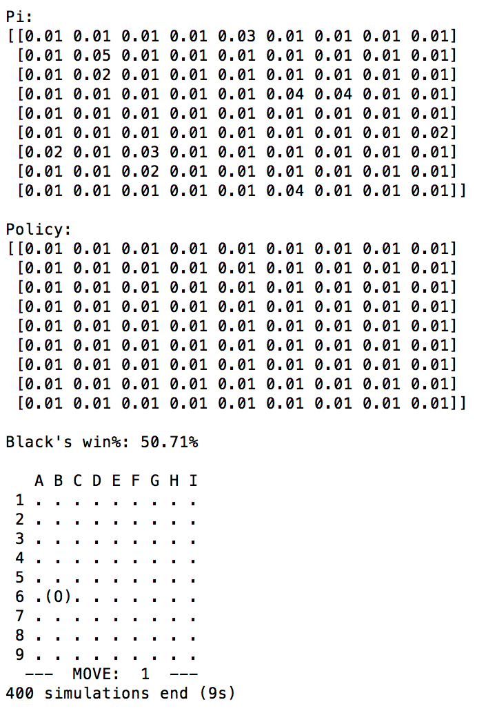
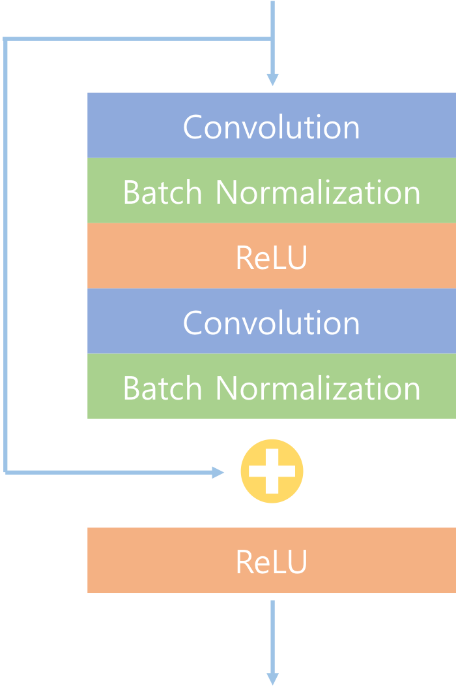
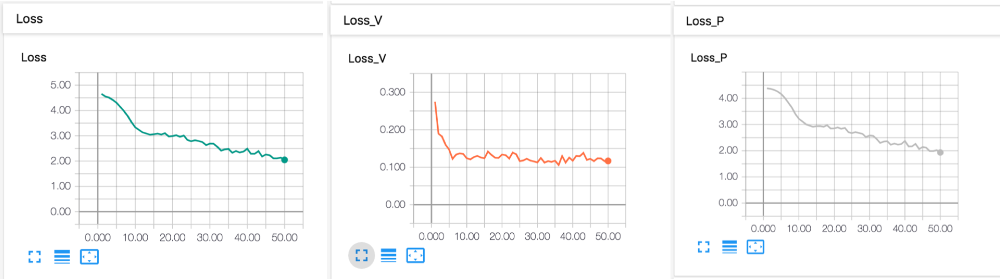

# Parameters

If you open the `main.py` code, you can find these parameters. 

  

The description of the parameters are as follows. 

### BOARD_SIZE

Size of the board 

- TicTacToe: 3x3

- env_small: 9x9
- env_regular: 15x15

### N_MCTS

The number of MCTS iterations. 4 steps of MCTS is 1 iteration. 4 steps of MCTS are as follows. 

- Selection 
- Expansion
- Simulation (AlphaGo zero doesn't have this process)
- Back up 

Therefore, 400 N_MCTS represents 400 iterations of MCTS. 

### TAU_THRES

The equation of selecting action in the AlphaGo Zero paper is as follows. 

  

tau is the parameter, which controls the level of exploration. If TAU_THRES is set as 6, tau = 1 for 6 moves of each game.  In this case, it selects moves proportionally to their visit count in MCTS, so it ensures a diverse set of positions are encountered. For the remainder of the game, tau -> 0 for exploitation. 

### SEED

Random seed. 

### PRINT_SELFPLAY

If you set this variable True, it prints all the moves and boards as follows.

 

  

### N_BLOCKS

Deep learning network for AlphaGo zero consists of many blocks. each block consists of the following structure.

 

  

If N_BLOCKS = 10, then 10 blocks connect sequentially.  

### IN_PLANES

In the paper, state of the algorithm is as follows. 

  

IN_PLANES represents the number of channels of the state. If IN_PLANES = 5, then state is as follows. 

  

### OUT_PLANES 

This is the number of the output channels of each block. 

### USE_TENSORBOARD

If USE_TENSORBOARD = True, () are recorded in Tensorboard. If you want to use tensorboard for Pytorch, you need to install [TensorboardX](https://github.com/lanpa/tensorboardX). Tensorboard contains policy loss, value loss and total loss. The equation of loss is as follows. 

  

Value loss is mean-squared error, policy loss is cross-entropy loss. Final term of the loss is L2 regularzation term. 

The graphs of loss are as follows. 

  

### N_SELFPLAY

N_SELFPLAY is the number of games before training. After N_SELFPLAY, network is trained at the end of every game. 

### TOTAL_ITER

After TOTAL_ITER games, algorithm is terminated. 

### MEMORY_SIZE

MEMORY_SIZE is size of the replay memory. In the AlphaGo Zero algorithm, following information is saved in the replay memory as a data. 

  

### N_EPOCH

N_EPOCH is the number of epoch when training. 

### BATCH_SIZE

It is size of batch for every training. 

### LR

LR is learning rate for training the algorithm. 

### L2

The equation of loss is as follows. 

  

L2 is c in the above equation. It is coefficient of L2 regularization. 