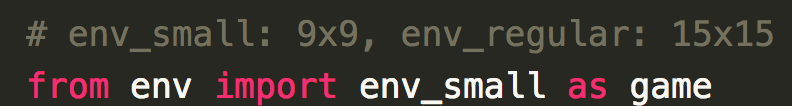

# How to change env

  

In the `main.py` , `eval_local.py` and `eval_server.py` code, you can import environment. If you import env_small, you can play with 9x9 board. If you import env_regular, you can play with 15x15 board. 

