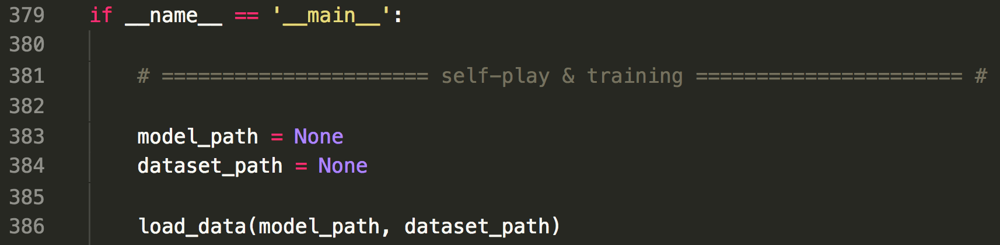

# How to load model

At the bottom of the `main.py` code, there is a code for setting the **model_path** and **dataset_path** as follows. 

  

If you run the `main.py` code, model and dataset file are saved in the `data folder` as a pickle file. Description of the files are as follows. 

- model: It contains the network variables. Therefore, you must write this, if you want to continue training or test the algorithm.  
- dataset: It contains replay memory data. If you don't add it and only load the model, It continues training with empty replay memory. Therefore, it is not an essential thing when loading the model, but I recommend to load it.   