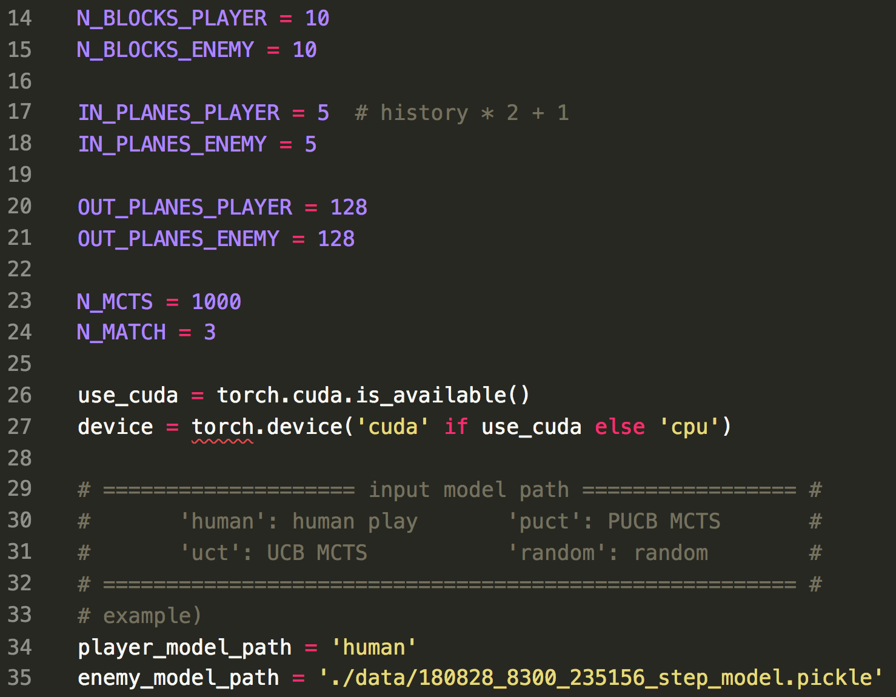
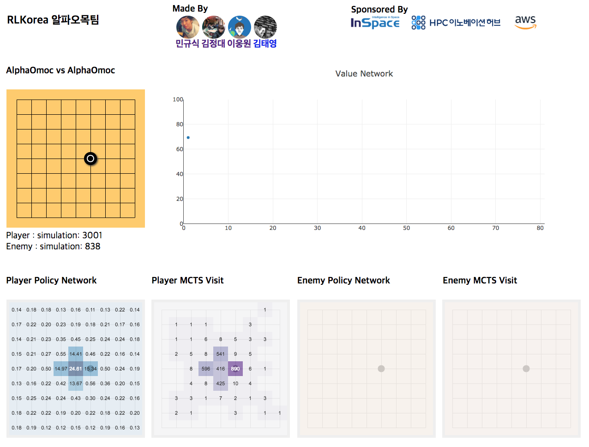

# How to use eval main

## Settings

At the `eval_main.py`, you should make a few settings. 

  

There are **player** and **enemy** for the evaluation. 

Player and enemy can be decided as follows. 

- human: human can play the game
- uct: play Omok with pure MCTS based on UCB 
- puct: play Omok with pure MCTS based on PUCT
- random: play Omok without any algorithm, it just play with random moves
- model path: If you write path of the model, it plays Omok with AlphaOmok algorithm with the variables that you set. 
- web: Human can play Omok on the web environment

Also, there is **Monitor_model_path** for web playing. You should set a model for this, then  you can use this to compare you play with AlphaOmok agent. This will be specifically described on the **Testing (Web)** part.  

### Parameters

If you want to test saved AlphaOmok model, you should set **N_BLOCKS**, **IN_PLANES** and **OUT_PLANES** according to the model. You can refer to the `log file` for finding those paramters of the model.

**N_MCTS** is the number of MCTS iterations. 4 steps of MCTS is 1 iteration. 4 steps of MCTS are as follows. 

\- Selection 

\- Expansion

\- Simulation (AlphaGo zero doesn't have this process)

\- Back up 

Therefore, 400 N_MCTS represents 400 iterations of MCTS. 

**N_MATCH** is the number of the games for testing. 

 ## Testing (Local)

If you finished the settings with `human` and run the `eval_main.py`, you can see the Omok playing between the agents or you can play Omok against the agent with `pygame`. You can see the demo that I played Omok with the AlphaOmok model as follows. 

 

  

## Testing (Web)

If you finished the setting with `web` and run `eval_main.py`, you should open the web browser and go to the following link. 

http://127.0.0.1:5000/dashboard

Then you can see the following web page. 

  

This is very good for verifying the model and debugging. 

Also, if you set the **Monitor_model_path**, you can compare your play with AlphaOmok agent. After your move is finished, you can check the **Player Policy Network** and **Player MCTS Visit**. The output of player policy network represents the probability of each move. Also, the output of player MCTS visit represents the move of the AlphaOmok agent. 

