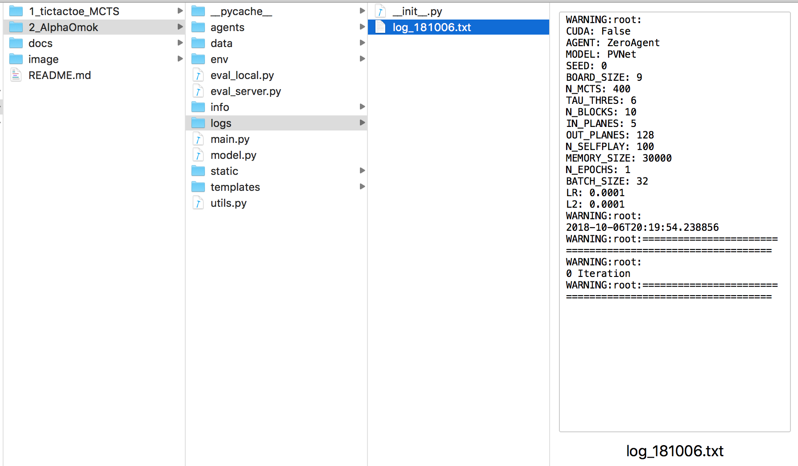

# Log file

If you run the `main.py`, **log file** is generated in `logs folder` as follows.

  

 

In the `log file`, you can check the parameter information about the training such as Cuda, Agent, Model and all the parameters that you can check in the [document about parameter](https://github.com/reinforcement-learning-kr/alpha_omok/blob/master/docs/2_Parameters.md). Also, you can check learning progress, information about replay memory, optimizer and loss values. These value are useful for debugging and checking the progress of training.

  

 

